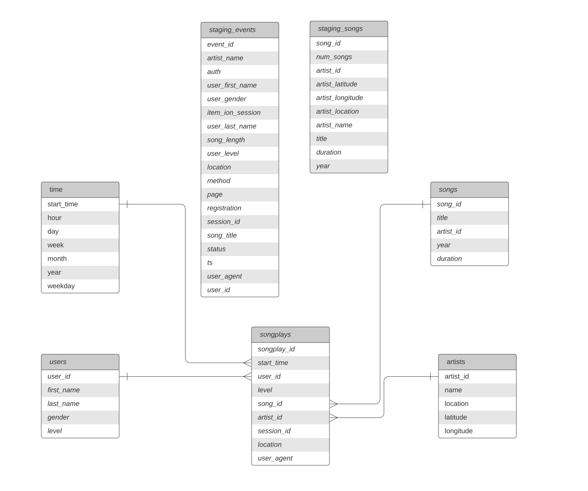

# Sparkify ETL Data Warehouse on Amazon Redshift
## Project Overview

Sparkify a music streaming startup has grown their user base and song database and want to move their processes and data onto the cloud. Their data resides in S3, in a directory of JSON logs on user activity on the app, as well as a directory with JSON metadata on the songs in their app.

In this project, we will create an ETL pipeline to build a data warehouses hosted on Redshift. 

## Project Datasets
* Song data: s3://udacity-dend/song_data
* Log data: s3://udacity-dend/log_data

#### Song Dataset: 
It's a subset of real data from [Million Song Dataset](https://labrosa.ee.columbia.edu/millionsong/). Each file is in JSON format and contains metadata about a song and the artist of that song. The files are partitioned by the first three letters of each song's track ID.

Sample Data:
```
{"num_songs": 1, "artist_id": "ARJIE2Y1187B994AB7", "artist_latitude": null, "artist_longitude": null, "artist_location": "", "artist_name": "Line Renaud", "song_id": "SOUPIRU12A6D4FA1E1", "title": "Der Kleine Dompfaff", "duration": 152.92036, "year": 0}
```

## Log Dataset
In this dataset consists of log files in JSON format generated by this  [event simulator](https://github.com/Interana/eventsim)  based on the songs in the dataset above. These simulate app activity logs from an imaginary music streaming app based on configuration settings.

The log files in the dataset are partitioned by year and month. 

Sample Data: 

    {"artist":null,"auth":"Logged In","firstName":"Celeste","gender":"F","itemInSession":0,"lastName":"Williams","length":null,"level":"free","location":"Klamath Falls, OR","method":"GET","page":"Home","registration":1541078e+12,"sessionId":438,"song":null,"status":200,"ts":1541990217796,"userAgent":"\"Mozilla\/5.0 (Macintosh; Intel Mac OS X 10_9_4) AppleWebKit\/537.36 (KHTML, like Gecko) Chrome\/36.0.1985.143 Safari\/537.36\"","userId":"53"}


## Schema for Song Play Analysis



#### Fact Table
***songplays*** - records in event data associated with song plays.

    songplay_id, start_time, user_id, level, song_id, artist_id, session_id, location, user_agent

#### Dimension Tables 
***users***

    user_id, first_name, last_name, gender, level
    
***songs***

    song_id, title, artist_id, year, duration

***artists***

    artist_id, name, location, lattitude, longitude

***time***

    start_time, hour, day, week, month, year, weekday

### Project Structure
* `create_tables.py` - This script will drop tables (if exist) and re-create new tables.
* `etl.py` - This script executes load queries that extract `JSON` data from the `S3 bucket` and ingest them to `Redshift`.
* `sql_queries.py` - This script contains variables with SQL statement in String formats, partitioned by `CREATE`, `DROP`, `COPY` and `INSERT` statement.
* `dhw.cfg` - Configuration file used that contains info about `CLUSTER`, `IAM_ROLE` and `S3`

## How to Run
#### Create tables

    $ python create_tables.py

#### Load Data

    $ python create_tables.py